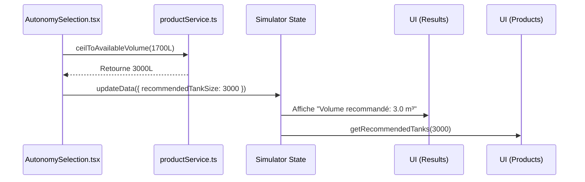

# Améliorations du Système de Recommandation de Volume

**Date:** 23 juin 2025  
**Auteur:** Louis-Clément (via Droid)  
**Branche:** `droid/improve-recommended-product-size`

---

## 1. Objectif

Ce document détaille les améliorations critiques apportées au simulateur de récupération d'eau de pluie. L'objectif principal était de **garantir que le volume de cuve recommandé corresponde systématiquement à un produit réel et disponible dans le catalogue**, tout en corrigeant des instabilités techniques majeures.

---

## 2. Problèmes de l'Ancien Système

L'implémentation précédente souffrait de plusieurs défauts critiques qui dégradaient l'expérience utilisateur et la fiabilité de l'application.

| # | Problème | Description Technique | Impact Utilisateur |
|---|----------|-----------------------|--------------------|
| 1 | **Recommandations Fantômes** | L'algorithme (`autonomy-selection.tsx`) arrondissait le besoin en eau au litre près (`Math.ceil`), générant des volumes comme `1700L` ou `2650L` qui n'existent pas dans le catalogue. | Frustration et confusion. L'utilisateur se voyait recommander un volume "optimal" qu'il ne pouvait pas acheter. |
| 2 | **Erreur de Chargement JSON** | L'appel `fetch('/data/products.json')` échouait en production en retournant une page HTML 404, provoquant une erreur fatale de parsing : `Unexpected token '<'`. | **Crash de l'application** à l'étape de recommandation des produits, rendant le simulateur inutilisable. |
| 3 | **Incohérence des Données** | La cuve "DAMONA" était nommée "465L" mais son volume dans le JSON était de `400`. | Calculs de dimensionnement potentiellement incorrects et manque de confiance dans les données. |
| 4 | **Logique de Filtrage Complexe** | `productService.ts` utilisait des plages de tolérance complexes (`*1.5`, `*3`) pour tenter de compenser les volumes "fantômes", ce qui rendait la logique difficile à maintenir. | Recommandations parfois sous-optimales ou difficiles à prévoir. |

---

## 3. Solutions Techniques Implémentées

### 3.1. Correction des Données (`public/data/products.json`)

- **Action :** Le volume de la cuve DAMONA (ID `78355`) a été corrigé de `400` à `465`.
- **Bénéfice :** Les données du catalogue sont désormais fiables et cohérentes avec les noms des produits.

### 3.2. Fiabilisation du Chargement des Produits (`lib/productService.ts`)

- **Action :** L'appel `fetch()` a été remplacé par un **import statique** de `products.json`.
  ```typescript
  import productsData from '@/public/data/products.json';
  
  export async function fetchProducts(): Promise<Product[]> {
    if (productsCache) return productsCache;
    productsCache = productsData as Product[];
    return productsCache;
  }
  ```
- **Bénéfice :** Élimination totale de l'erreur `Unexpected token '<'`. Les données sont incluses au moment du build, garantissant leur disponibilité et leur intégrité.

### 3.3. Centralisation de la Logique d'Arrondi (`lib/productService.ts`)

Deux fonctions utilitaires ont été créées pour centraliser la logique de volume :

1.  **`getAvailableTankVolumes()`**: Récupère et met en cache la liste triée et unique de tous les volumes de cuves disponibles.
2.  **`ceilToAvailableVolume(calculatedVolume)`**: Le cœur de la nouvelle logique. Cette fonction prend un volume calculé et retourne le **premier volume disponible dans le catalogue qui est supérieur ou égal**.

    *   Exemple : `ceilToAvailableVolume(1700)` → retourne `3000`.
    *   Exemple : `ceilToAvailableVolume(350)` → retourne `400`.
    *   Cas limite : `ceilToAvailableVolume(22000)` → retourne `20000` (le volume maximum disponible).

### 3.4. Intégration dans le Calculateur (`components/steps/autonomy-selection.tsx`)

- **Action :** La fonction `calculateResults` est désormais `async` et utilise la nouvelle logique d'arrondi.
  ```typescript
  // Ancien calcul
  // const recommendedTankSize = Math.ceil(recommendedTankSizeM3 * 1000);

  // Nouveau calcul
  const rawRecommendedTankSize = recommendedTankSizeM3 * 1000;
  const recommendedTankSize = await ceilToAvailableVolume(rawRecommendedTankSize);
  ```
- **Bénéfice :** Le `recommendedTankSize` stocké dans l'état du simulateur est **toujours** un volume de produit réel, ce qui simplifie grandement la logique en aval.

---

## 4. Workflow Après Améliorations

Le flux de données est désormais plus simple, plus robuste et plus logique.



---

## 5. Conclusion : Bénéfices Clés

1.  **Fiabilité Accrue :** L'application ne crashe plus sur l'étape des recommandations.
2.  **Expérience Utilisateur Cohérente :** Le volume recommandé est toujours un produit achetable, éliminant toute confusion.
3.  **Maintenance Simplifiée :** La logique est centralisée. Un changement dans `products.json` est automatiquement pris en compte sans nécessiter de modification du code de calcul.
4.  **Confiance dans les Données :** Les données produits sont désormais justes et fiables.
